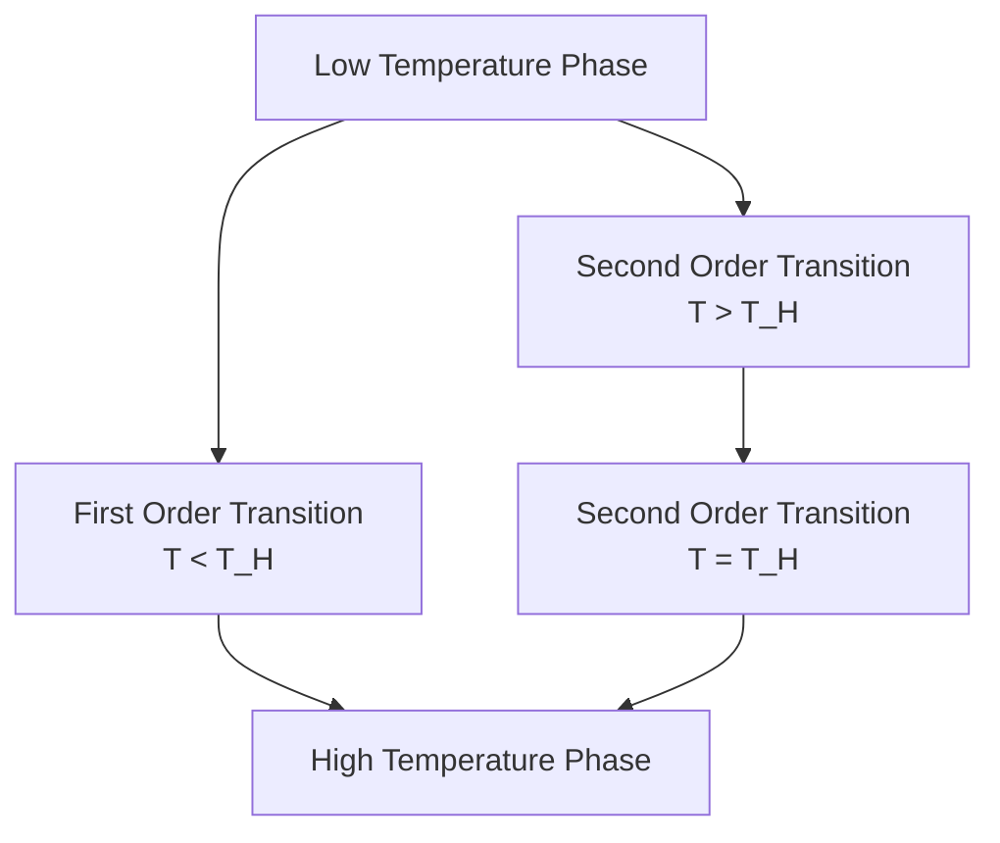

This is a review of Aharony, Marsano, Minwalla, Papadodimas, $\textit{&}$ Van Raamsdonk's **[paper](https://arxiv.org/abs/hep-th/0310285)**. In this first part, we will review the main ideas behind the study by studying their abstrat, introduction, and discussion. In the next part, we will review their methods and results.

<!--more-->

## Abstract

### Purpose of Study

Obtain insight into phase transitions of a weakly coupled large $N$ gauge theory in various temperature limits.

### Results

1. Demonstrated that a weakly coupled, large $N$,  $d$-dimensional $SU(N)$ gauge theory on a class of compact spatial manifolds (including $S^{d-1}\times$ time) undergoes a deconfinement phase transition at special temperatures.

2. The phases are separated either by 
   - A single first order transition occuring below the Hagedorn temperature
   - Two continuous phase transitions, the first occuring at the Hagedorn temperature.

### Methodology

The Yang-Mills partition function is reduced to an integral over a unitary matrix $U$. Deconfinement transitions are large $N$ transitions in the matrix. 

### Conclusions

1. These phase transitions <u>might be</u> linked to the usual flat space deconfinement transition for confining gauge theories and to the Hawking-Page $AdS_5-$BH nucleation phase transition in the case of $\mathcal{N}=4$ SYM.
2. <u>Suggest</u> deconfinement transitions to be interpreted in terms of black hole formation in a dual string theory.

***

## Discussion

### Overview

In this paper, the thermodynamics of weakly coupled, large $N$, gauge theories compactified on a sphere of radius $R$, or any other compact manifold on which the theory has no **zero modes** was analyzed.

Analysis applies to:
- Conformal gauge theories at small values of a tunable coupling.
- Confining theories with $R\Lambda_{QCD}\ll 1$.

At finite coupling, the microcanoncial ensemble of these theories have an exponential (Hagedorn) density of states which is cut off at an energy of order $E\sim N^2$.  At zero coupling, the Hagedorn temperature is determined from field content and corrections from perturbation theory. 

### Insights

1. **Statement**: A confining gauge theory on a compact space introduces a dimensionlesss tunable parameter. Varying this tunable parameter continuously deforms the flat space deconfinement transition _(no perturbation theory)_ into a curved space deconfinement transition _(perturbation theory is reliable)_.
  
   1. _Consequence_: If the large $N$ deconfining phase transition is of second order, then it must be Hagedorn-like.
   2. _Consequence_: A large $N$ deconfining phase transition is followed by a second phase transition at a higher temperature.
      - **Conclusion**: A second order deconfining transition in any large $N$ gauge theory <u>might</u> imply the existence of a previously unsuspected intermediate temperature phase.
      - **Conclusion**: The four simplest possible phase diagrams are in the results section.
      - **Conclusion**: <u>Suggests</u> a stringy interpretation of deconfinement transition in terms of black hole nucleation *(speculative)*.
   
2. **Statement**: The thermal phase transition of an $\mathcal{N}=4$ SYM at weak coupling is either of first or second order, depending on the sign of a coefficient.
   1. _Consequence_: If the transition is first order, then this suggests **Hagedorn censorship**.
   2. _Consequence_: If the transition is second order, then this suggests the existence of a tri-critical point at finite $\lambda$ **and** the existence of a previously unsuspected intermediate temperature phase.
      - **Conclusion**: Intermediate temperature phase should have a dual bulk description; <u>mysterious new stable black holes.</u>

3. **Critique**: 't Hooft's strong coupling relation between large $N$ gauge theories and string theories <u>may</u> also extend to weakly coupled gauge theories.
   1. *Evidence*: AdS/CFT establishes a relationship between string and gauge theories on a sphere at all values of the gauge coupling. 
   2. *Evidence*: This paper has shown that for weakly coupled gauge theories on compact manifolds, at least one qualtitative feature is shared with string theory, namely a string-like spectrum.
      - **Future Direction**: How and why do weakly coupled gauge theories manage to rearrange themselves as string theories.

4. **Applicability**: <u>It may be possible that</u> the connection between Hagedorn transitions, black hole formation, and 'deconfinement' transition in a dual field theory is general **and** the analysis of this paper <u>may</u> be extended to search for intersting features in generalized partition functions.

   For instance, the partition function generalized by an addition of a chemical potential for an $R-$symmetry charge in the strongly coupled $\mathcal{N} =4$ SYM theory undergoes a phase trasnition as a function of the chemical potential even at zero temperatures. [Footnote 63]
   1. *Evidence*: Using the analytic techniques of this paper, the **zero temperature** phase transition is absent in the free Yang-Mills theory. At **finite temperature**, the analytic techniques break down at some critical value when additional degrees of freedom become light and charged scalars may condense.
      - **Conclusion**: The strong and weak coupling regimes seem qualitatively different in this case.

## Introduction

**Vocabulary Index**

> Hagedorn Censorship: The Hagedorn spectrum of string theory on $AdS_5\times S^5$ does not dominate the thermodynamics of $\mathcal{N}=4$ SYM at **any** temperature or **any** non-zero value of the coupling.

> Hagedorn Temperature: The boiling point of hadronic matter.

> Zero Modes: An eigenvector with a vanishing eigenvalue.