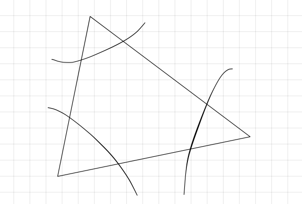

# Partition Function for a Free Yang-Mills on a Compact Space

This post is largely a derivation of the partition function for a free Yang-Mills theory on a compact space;

$$\ln(\mathcal{Z}) = - \sum_{k=1}^\infty\ln(1-z_B(x^k)+(-1)^kz_F(x^k))$$

The original (partial) derivation may be found in [paper](https://arxiv.org/abs/hep-th/0310285). We expound upon the details in this article.

---

## Building the Partition Function

## The Large $N$ Partition Function for Single Trace States with $k$ Oscillators

The large $N$ limit of the partition of single-trace trace with $k$ oscillators is analytically provided by

This is a caption for the above figure

$$\mathcal{Z}_{\text{ST}} = -\sum_{q=1}^\infty\frac{\varphi(q)}{q}\ln(1-z(x^q))$$

where $\varphi(q)$ is Euler's totient function. The majority of the heavy lifting in the upcoming proof comes from careful algebraic manipulations of the totient function. In that spirit, we will enter a brief discourse into the properties of said function.

### Euler's Totient Function

Here we will outline several properties and proofs regarding the totient function.

Our goal, by the end of this section, is to prove the following statement

$$\sum_{q|k}\varphi(q)=k.$$